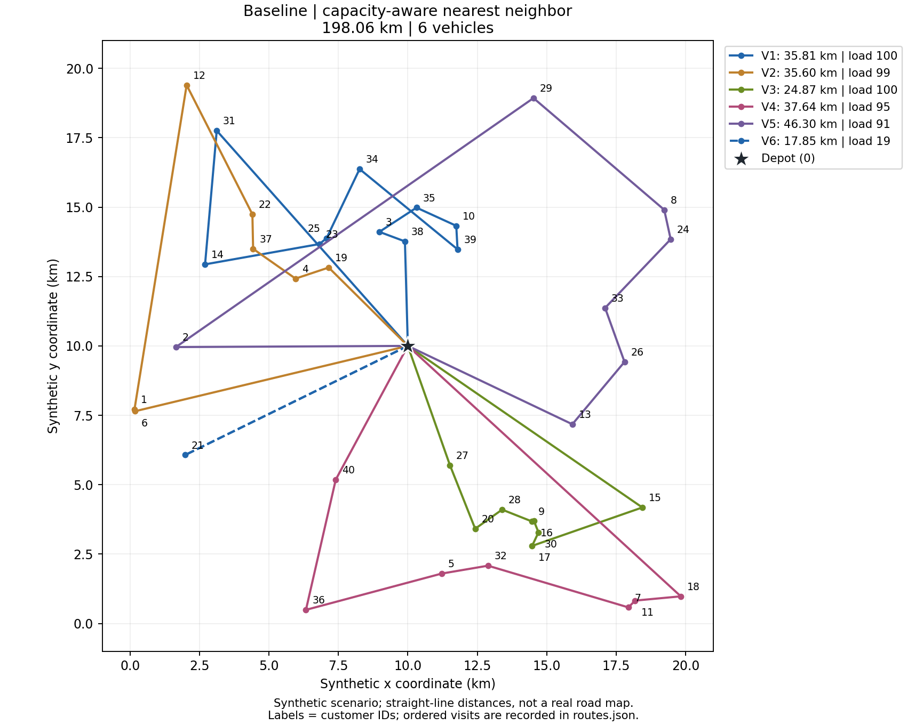
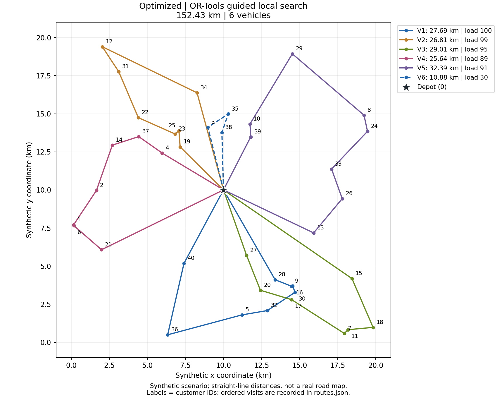
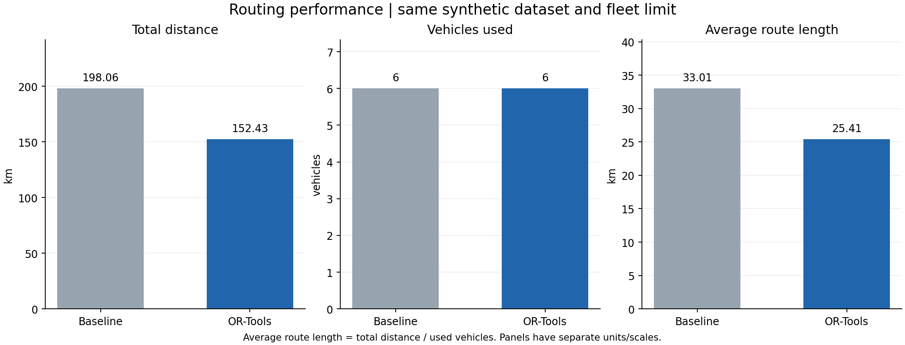

# Urban Logistics Vehicle Routing Optimization with Python

A reproducible transportation and logistics project comparing a capacity-aware nearest-neighbor baseline with a Google OR-Tools solution to the Capacitated Vehicle Routing Problem (CVRP).

**All delivery data are synthetic.** This is an educational modeling experiment, not a case study of an actual carrier, city, or operating fleet. Reported distances are simulated Euclidean distances, not measured road mileage. Numerical results below are inserted by an actual code run.

## Problem

A distribution center must deliver goods to 40 customers in a hypothetical urban service area. Customers have known demands, and identical vehicles have limited capacity. We seek shorter total routes while ensuring that:

- Every customer is visited exactly once; deliveries cannot be split.
- Each used vehicle starts and ends at the depot and makes one trip.
- The total demand assigned to each vehicle does not exceed its capacity.
- The number of used vehicles does not exceed the common fleet limit.

The project demonstrates transportation modeling, feasibility checking, routing optimization, and reproducible data analysis. It does not include deep learning.

## Dataset

`data/synthetic_customers.csv` contains one depot and 40 customers by default. NumPy's `default_rng(2027)` generates independent uniform customer coordinates in a 20 km × 20 km square, rounded to 0.001 km, followed by integer demands uniformly drawn from 5 through 20 units. The depot is at (10, 10) km with zero demand. Vehicle capacity is 100 standardized load units; these are neither kilograms nor cubic meters.

| Column | Meaning |
|---|---|
| `node_id` | Contiguous integer ID; 0 is the depot |
| `node_type` | `depot` or `customer` |
| `x_km`, `y_km` | Local synthetic Cartesian coordinates, not latitude/longitude |
| `demand_units` | Positive integer customer demand; depot demand is zero |
| `data_source` | Always `synthetic` |

There are no personal addresses or external operational records. The seed was fixed before observing results; the delivered result is not selected from a seed search. A fixed seed reproduces data under the pinned dependencies, but a time-limited solver may return different routes across computers or runs.

## Methodology

### 1. Distance model

For each pair of nodes, compute `round(1000 * sqrt((x_i-x_j)^2 + (y_i-y_j)^2))`. This produces an integer meter cost for OR-Tools. Both methods are evaluated with exactly this matrix, including depot departures and returns. Final distances divide the integer sums by 1,000. Rounding can change each edge by at most half a meter.

### 2. Baseline: capacity-aware nearest neighbor

Start an empty route at the depot. Visit the nearest unserved customer whose demand fits the remaining capacity; break distance ties by customer ID. If no customer fits, return to the depot and start the next vehicle. Repeat until all customers are served.

This is a simple geographical heuristic, not a random or intentionally inefficient route. It makes local decisions and cannot reconsider earlier assignments. Its route count supplies a feasible fleet upper bound by default. OR-Tools receives the same bound; this is an experimental design choice, not an estimate of the minimum fleet. `--vehicles` can supply an explicit upper bound, provided the baseline also fits it.

### 3. Optimization: OR-Tools CVRP

The objective is to minimize the sum of arc distances across all routes. `RoutingIndexManager` maps routing indices to customer IDs. A distance callback supplies arc costs, and a demand callback plus `AddDimensionWithVehicleCapacity` enforces each vehicle's load limit. No optional-customer penalties are added, so every customer is mandatory.

The feasible baseline seeds the search through `ReadAssignmentFromRoutes`. Guided Local Search improves assignments and visit sequences within a 10-second search budget. The returned objective is checked against independently summed route distances and against the starting baseline. A failure is reported explicitly, not replaced by invented results.

This is a **time-limited heuristic solution**. There is no proof of global distance optimality. Used-vehicle count, workload balance, travel time, cost, and emissions are not separate optimization objectives. The capacity accumulator records demand assigned along a route; for deliveries this is an accounting device, not the physical remaining cargo after each stop.

### 4. Evaluation

| Metric | Definition |
|---|---|
| Total distance | Sum of all closed-route distances |
| Vehicles used | Number of routes serving at least one customer |
| Average route length | Total distance / used vehicles |
| Longest route | Maximum individual route length |
| Capacity utilization | Total demand / (used vehicles × vehicle capacity) |
| Distance reduction | `(baseline - optimized) / baseline × 100%` |
| Routing runtime | Measured wall time for baseline construction or model construction plus solver search; excludes plotting and export |

Capacity utilization measures assigned loads, not a distance-weighted on-road loading rate. Average route length can rise when fewer vehicles are used, even when total distance falls. Solver runtime excludes the baseline construction used to seed it; add the two for total routing computation time.

## Results

<!-- RESULTS_START -->
Actual code run: 40 synthetic customers, demand 504 units, capacity 100 units/vehicle, fleet limit 6, search budget 10 seconds.

| Metric | Baseline | OR-Tools |
|---|---:|---:|
| Customers served | 40 | 40 |
| Vehicles used | 6 | 6 |
| Total distance (km) | 198.064 | 152.433 |
| Average route length (km) | 33.011 | 25.405 |
| Longest route (km) | 46.295 | 32.392 |
| Capacity utilization (%) | 84.00 | 84.00 |

Distance reduction: **23.04%** (45.631 km). A feasible heuristic solution; global optimality is not established.

Source: `results/summary.csv`, `results/route_details.csv`, and `results/run_metadata.json`.
<!-- RESULTS_END -->





Route colors identify vehicles within each panel; vehicle IDs are not persistent entities across methods. Lines are schematic connections. For exact direction and stop order, inspect `results/routes.json` or `results/route_details.csv`.

These results describe one synthetic instance against one baseline. They do not establish general performance across cities, statistical significance, real-world cost savings, or an equivalent percentage reduction in fuel use or emissions. The longest route is reported to help identify possible workload imbalance, although service durations are not modeled.

## How to Run

Use **64-bit Python 3.12** on Windows. No paid solver, GPU, web service, or API key is required. Install dependencies online once; subsequent runs can be offline. The delivered project was executed on Windows with the environment recorded in `results/run_metadata.json`.

Open PowerShell in this repository folder:

```powershell
py -3.12 -m venv .venv
.\.venv\Scripts\python.exe -m pip install -r requirements.txt
.\.venv\Scripts\python.exe main.py
.\.venv\Scripts\python.exe -m unittest discover -s tests -v
```

Calling the virtual environment's Python directly avoids PowerShell activation-policy issues. If `py` is unavailable, install Python 3.12 from [python.org](https://www.python.org/downloads/windows/) with its launcher, or use the full path to your Python 3.12 executable. On other platforms, the analogous interpreter is `.venv/bin/python`; those platforms were not tested for this delivery.

The default command regenerates the bundled dataset, result files, and marked Results blocks in both documents. Keep the delivered files or commit them before experimenting. Write alternative scenarios to a separate folder to preserve the default evidence:

```powershell
.\.venv\Scripts\python.exe main.py --customers 50 --seed 2027 --capacity 100 --seconds 10 --output experiments/50-customers
.\.venv\Scripts\python.exe main.py --input data/synthetic_customers.csv --vehicles 8 --seconds 20 --output experiments/larger-fleet
```

Supported generated size: 1–200 customers; 30–50 is the intended portfolio scale. If a chosen fleet is smaller than the baseline requires, the comparison stops with an explanation. That does **not** prove the CVRP has no feasible solution with that fleet. Custom CSV files must follow the same schema and remain explicitly synthetic. The generated coordinate distribution is a modeling assumption, not a description of all supported custom inputs.

### Repository structure

```text
urban-logistics-routing/
├── main.py                     # Complete experiment and reproducible exports
├── data.py                     # Synthetic data, validation, distance matrix
├── routing.py                  # Baseline, OR-Tools model, feasibility, route metrics
├── plotting.py                 # Two route plots and performance comparison
├── requirements.txt            # Primary packages constrained to tested versions
├── requirements-lock.txt       # Full tested dependency versions
├── README.md                   # English project report and running instructions
├── PROJECT_EXPLANATION.md      # Chinese walkthrough and 10 interview questions
├── .gitignore
├── data/
│   └── synthetic_customers.csv
├── results/
│   ├── summary.csv
│   ├── route_details.csv
│   ├── routes.json
│   ├── run_metadata.json
│   ├── RESULTS.md
│   ├── validation.txt           # Actual acceptance-check output
│   ├── baseline_routes.png
│   ├── optimized_routes.png
│   └── performance_comparison.png
└── tests/
    └── test_project.py
```

`requirements.txt` uses `requirements-lock.txt` as constraints, so the normal installation command selects the tested dependency versions. Metadata records package versions, dataset SHA-256, search settings, timestamp, and actual environment. Wall-clock stopping means bit-for-bit solver reproducibility is not guaranteed, even with pinned packages; the exported routes preserve the delivered solution exactly.

### Testing and inspection

The standard-library `unittest` checks deterministic data generation, invalid input rejection, a known 3–4–5 distance, inclusion of the depot return, route capacity and exact customer coverage, 30/40/50-customer solutions, and a tiny four-customer case independently enumerated to find the exact optimum. That tiny-case check does not prove optimality for the 40-customer experiment. Each full run also checks route feasibility and reconciles the solver objective to measured distance.

## Future Improvements

1. Replace straight-line distances with a documented road-network matrix, including one-way streets and travel times.
2. Add customer time windows, service durations, and driver shift limits when such data are available.
3. Compare with sweep or Clarke–Wright savings and evaluate multiple seeds and search budgets before making general performance claims.
4. Run capacity/fleet sensitivity experiments and introduce explicit vehicle fixed costs if fleet minimization becomes part of the decision.
5. Use heterogeneous vehicles or validated emissions factors only when supported by credible input data.

## Attribution and scope

The modeling APIs follow the official [Google OR-Tools CVRP guide](https://developers.google.com/optimization/routing/cvrp), [initial-route documentation](https://developers.google.com/optimization/routing/routing_tasks), and [routing search options](https://developers.google.com/optimization/routing/routing_options). The project-specific dataset, baseline comparison, checks, reporting, and explanations are included here.

This implementation and documentation were prepared with AI assistance. A portfolio author should reproduce the results, understand the constraints and code, and accurately describe their own contributions. Using an established solver is appropriate; claiming to have invented its optimization algorithm is not.

Repository: [krisgu0527/urban-logistics-routing](https://github.com/krisgu0527/urban-logistics-routing). Download the project through **Code > Download ZIP**, or clone it with `git clone https://github.com/krisgu0527/urban-logistics-routing.git`, then follow the Windows instructions above. The repository includes the synthetic data and measured results; virtual environments, caches, and credentials are excluded.
